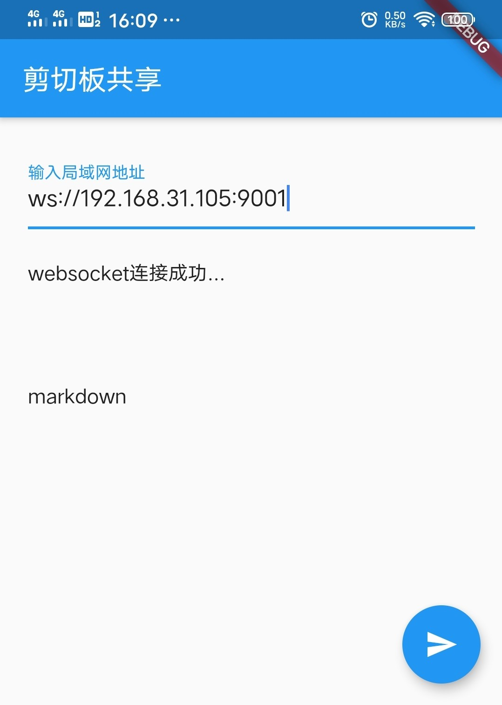

电脑/手机 剪切板实时共享工具[手机端]

局域网快速通信/Websocket/flutter  

now: linux/android  

服务端: [clipboard](https://github.com/dreamlu/clipboard)

环境：  
android

运行:  
1.下载安装

已完成：  
1.提供剪切板实时共享服务端  
2.输入ip:port动态输入  

TODO  
~~1.提供后台进程全局共享(弃)~~  
2.自动构建  
3.支持更多系统  
4.样式优化  

> 遗憾: android 10以后无法后台获取剪切板内容  

- 如图  

